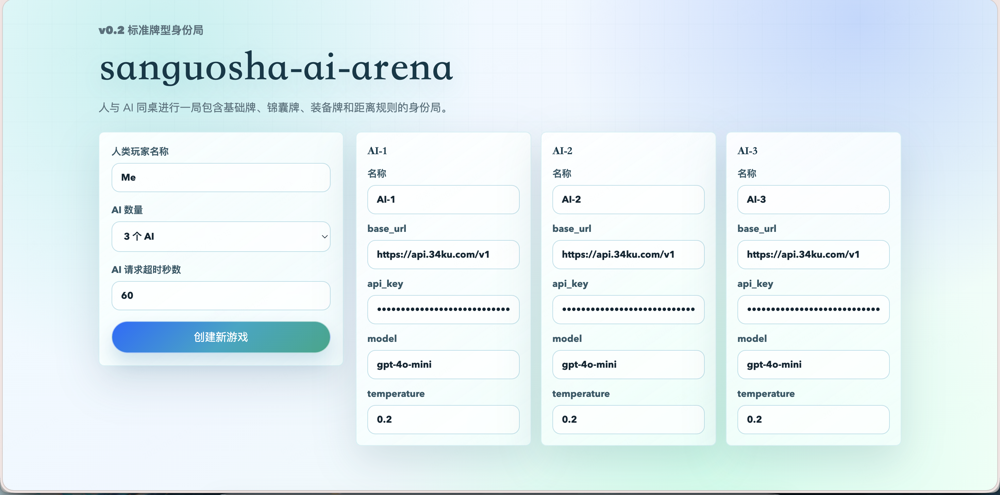
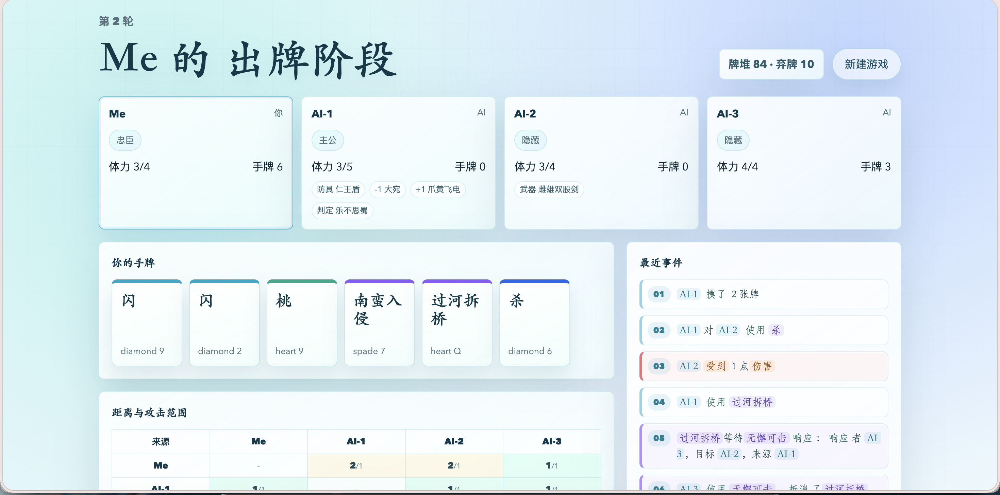
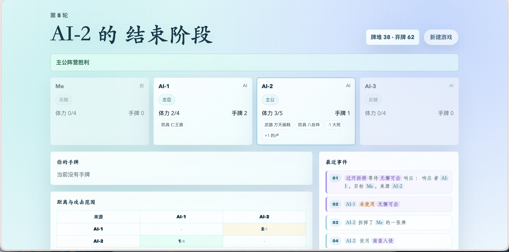
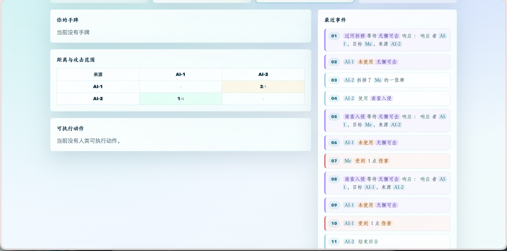

# sanguosha-ai-arena

`sanguosha-ai-arena` 是一个“人与 AI 玩三国杀”的开源项目。当前 v0.2 聚焦完善标准游戏牌、后端合法动作约束和 AI 决策提示词，不加入武将、英雄技能或官方素材。

本项目不使用任何三国杀官方图片、官方卡面或官方素材。前端只使用自制的文字卡牌 UI。

## 项目展示

<div align="center">
  
</div>

<br />

<div align="center">
  
</div>

<br />

<div align="center">
  
</div>

<br />

<div align="center">
  
</div>

## 当前版本(v0.2)项目特性

- 人类玩家 + 1 到 5 个 AI，合计 2 到 6 人。
- 身份局：主公、忠臣、反贼、内奸；主公身份公开，其他身份按可见性脱敏。
- v0.2 牌堆扩展为 108 张标准版游戏牌，包含基础牌、锦囊牌、延时锦囊、武器、防具和坐骑。
- 已实现杀、闪、桃、无懈可击、南蛮入侵、万箭齐发、决斗、无中生有、桃园结义、五谷丰登、过河拆桥、顺手牵羊、借刀杀人、乐不思蜀、闪电等牌型。
- 已实现装备区、判定区、攻击范围、坐骑距离、诸葛连弩、青釭剑、八卦阵、仁王盾等无武将技能版本下的基础效果。
- 后端唯一负责规则判断、响应链、濒死求桃、弃牌和动作合法性校验。
- 前端只展示后端返回的 `legal_actions`，非法牌不会出现在按钮区。
- AI 通过 OpenAI-compatible Chat Completions API 决策，只能选择后端给出的 `action_id`。
- AI Prompt 会显式提供 v0.2 牌型规则、身份目标、公开状态、手牌、装备区、判定区和合法动作。
- 每个 AI 可单独配置 `base_url`、`api_key`、`model`、`temperature`。
- 创建游戏时可配置 AI 请求超时秒数，范围为 10 到 120，默认 30。
- 返回给前端的状态会脱敏：不泄露其他玩家手牌，不回显 AI `api_key`。

## 新增内容

### 2026.06.28

- 将版本升级到 v0.2。
- 将牌堆从 55 张 MVP 牌扩展为 108 张标准版游戏牌。
- 新增锦囊、延时锦囊、装备牌、距离和攻击范围。
- 新增无懈可击响应、群体锦囊逐目标结算、完整濒死求桃、装备区和判定区公开展示。
- 强化后端合法动作约束：当前状态不能出的牌不会返回给前端或 AI。
- 强化 AI Prompt：显式列出所有已实现牌型规则，并要求模型严格从 `legal_actions` 中选择。

### 2026.06.27

- 优化前端玻璃拟态效果和字体效果。
- 优化模型推理逻辑，让模型决策更具多样性。

## 快速启动

建议先启动后端，再启动前端。

### 后端启动

```bash
cd backend
python -m venv ../.venv
../.venv/bin/python -m pip install -r requirements.txt
PYTHONPATH=. ../.venv/bin/uvicorn app.main:app --reload --port 8000
```

健康检查：

```bash
curl http://localhost:8000/health
```

### 前端启动

```bash
cd web
npm install
npm run dev
```

前端默认连接 `http://localhost:8000`。如需修改后端地址，可设置 `VITE_API_BASE_URL`。

## AI 配置说明

新建游戏时，每个 AI 都可以单独配置：

- `name`：AI 展示名称。
- `base_url`：OpenAI-compatible 服务地址，例如 `http://localhost:8000/v1`。
- `api_key`：鉴权 token，前端提交给后端后不会在状态接口中回显。
- `model`：模型名称，例如 `qwen`。
- `temperature`：温度，默认 `0.2`。

创建游戏页面还提供全局 AI 请求超时秒数，默认 `30`，最小 `10`，最大 `120`。非法输入会按 `30` 处理。

## OpenAI-compatible 接口说明

后端会请求：

```text
POST ${base_url}/chat/completions
Authorization: Bearer ${api_key}
```

请求体使用 Chat Completions 常见结构：`model`、`messages`、`temperature`、`max_tokens`，并要求模型返回 JSON。AI 只能返回：

```json
{
  "action_id": "play_sha:p0",
  "reason": "简短理由"
}
```

后端只执行 `action_id`，不会执行自由文本理由。

## 项目结构

```text
sanguosha-ai-arena/
  backend/   FastAPI 后端、规则引擎、AI 客户端、测试
  web/       React + Vite + TypeScript 前端
  docs/      规则文档、状态协议、AI 协议
```

## 架构说明

本项目采用“后端规则引擎 + AI 合法动作选择”的架构。AI 输出不稳定，前端也不应该成为裁判。所有玩家动作都必须先由后端生成 `legal_actions`，人类或 AI 只能提交其中某个 `action_id`。这样可以保证规则边界清晰，非法动作会被拒绝。

AI Prompt 使用字段化状态，并在 v0.2 显式携带牌型规则摘要。后端发送当前 AI 需要的信息：自己的手牌、公开玩家信息、装备区、判定区、最近事件、阶段、合法动作和身份目标。模型负责策略选择，不负责判定动作是否合法。

## License

MIT License，copyright (c) 2026 hyf020908。

## 后续待实现功能

- 继续校准标准规则细节，例如更多武器特效、锦囊响应优先级和更完整的多人目标选择。
- 完整实现内奸单独胜利条件和奖惩摸牌规则。
- 反复迭代模型推理效果、身份推理和阵营策略。
- 在后续大版本加入英雄选择和武将技能。
